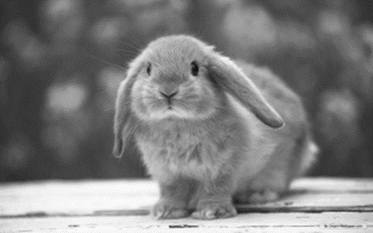

# CS 112 Image Manipulator Milestone #1
For this milestone, you will extend the basic image manipulation functionality developed in PA #3.  In PA #3, you wrote a program that set all red values to 0.  In this assignment, you will add the following image effects:

## 1. Remove all red (PA #3 deliverable)
To remove all red from an image, set all red pixels equal to 0.  Recall that PPM data is in the repeating format RGB RGB RGB ...
Thus, you will need to set every 3rd value to 0 starting with the 1st data item (element 0 in array terms).  Here is our bunny image with the red removed:

  

## 2. Remove all green
To remove all green from an image, set all green pixels equal to 0.  Recall that PPM data is in the repeating format RGB RGB RGB ...
Thus, you will need to set every 3rd value to 0 starting with the 2nd data item (element 1 in array terms).  Here is our bunny image with the green removed:

  

## 3. Remove all blue
To remove all blue from an image, set all blue pixels equal to 0.  Recall that PPM data is in the repeating format RGB RGB RGB ...
Thus, you will need to set every 3rd value to 0 starting with the 2nd data item (element 1 in array terms).  Here is our bunny image with the blue removed:

  

## 4. Negate Red
To negate red, subtract each red pixel's current value from 255 (e.g. 255 - RED value).  Then, replace the current red value with that number.  For example, if we have the RGB triplet 100 150 5, the new RGB triplet would be 155 150 5.  Here is our bunny image with the red negated:

  

## 5. Negate Green
To negate green, subtract each green pixel's current value from 255 (e.g. 255 - GREEN value).  Then, replace the current green value with that number.  For example, if we have the RGB triplet 100 150 5, the new RGB triplet would be 100 105 5.  Here is our bunny image with the green negated:

  

## 6. Negate Blue
To negate blue, subtract each blue pixel's current value from 255 (e.g. 255 - BLUE value).  Then, replace the current blue value with that number.  For example, if we have the RGB triplet 100 150 5, the new RGB triplet would be 100 150 200.  Here is our bunny image with the blue negated:

  

## 7. Grayscale
To turn an image into a grayscale image, set each RBG triplet to the average of its three numbers.  For example, if we have the RGB triplet 100 150 5, the new RGB triplet would be 85 85 85.  Here is our bunny image with the blue negated:



# Program Operation
Your program should prompt the user for an input and output file as well as the operation that the user would like to perform.  Here's an example:

```
Enter source file: tinypix.ppm
Enter destination file: output.ppm

*** Image Effects ***
1. Remove Red
2. Remove Blue
3. Remove Green
4. Negate Red
5. Negate Blue
6. Negate Green

Selection: 5

Applying Negate Blue effect...
Done.  Program complete.
```

# Due date
This assignment is due Monday, October 14, 2019. 

# Submission
To submit your assignment, check your code into your new CS112-ImageManipulation repository.  Inside the deliverables\m1 subdirectory, place your output files for each image effect using the provided bunny2.ppm.  Include your milestone #1 reflection in this folder as well.  Note, there is no need to make a demo GIF for this deliverable.

# Grading
This assignment is worth 100 points:
* 60 points for completing the task (demonstrate good progress, regular github checkins, good github comments, maintaining your project board)
* 20 points for correct program output (i.e. all of your image effects work properly)
* 10 points for demonstrating progress during checkins 
* 10 points for your reflection.  For inspiration, see [my prompts](../../docs/sample_reflection.md) 

# About the PPM Image Specification
Before beginning this assignment, you will need some sort of imaging software that can open PPM-based images.  I recommend  [Ifranview](https://www.irfanview.info/files/iview453_x64.zip) for Windows as it's free and lightweight.
PPM Image Format
The PPM image format is encoded in human-readable ASCII text.  It might be helpful to read over the formal PPM specification document. A PPM document has two pieces: the header and the body.  The header is always the top three uncommented lines in the file:
```
P3
4 4
255
```
The first line specifies the type of image that is contained within the file.  We will always use the "P3" specification.  The second line specifies the number of columns and rows present in the image.  In this example, we have a 4x4 image.  The final number indicates the maximum value for each red, green, and blue element in the picture.  Having a max value of 255 is quite common and is the value that we will always use.  Below the header is the body of the PPM file.  Each pixel has a red, green, and blue value.  For example, the content of our 4x4 image might be:
```
0  0  0       100 0  0       0  0  0       255   0 255

0  0  0       0 255 175      0  0  0        0    0  0

0  0  0       0  0  0        0 15 175       0    0  0

255 0 255     0  0  0        0  0  0       255  255 255
```
With these values, the pixel in the first column and row has a RGB value of (0,0,0) and the last column in the first row has an RGB value of (255,0,255). 


