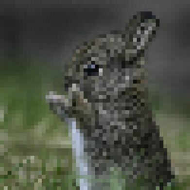
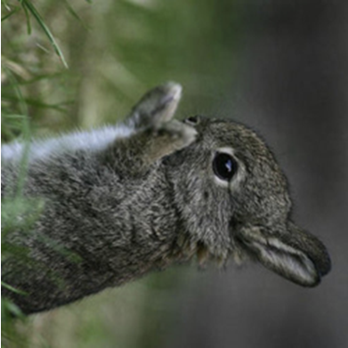

# CS 112 Image Manipulator Milestone #3
Milestone #3 further extends our image manipulator by adding 4 advanced image effects:

## 1. Flip Horizontally
This will flip the supplied image horizontally.  To accomplish, you will need to loop through your image and switch the order of every column.  For example, if our picture had four columns numbered 0-3, you would need to swap columns 0 and 3, and columns 1 and 2.  

### Before
 

### After
 

## 2. Flip Vertically
This will flip the supplied image vertically.  To accomplish, you will need to loop through your image and swap the order of every row.  For example, if our picture had four rows numbered 0-3, you would swap row 0 with row 3, and row 1 with row 2.

 

## 3. Blur
To perform a blur, you will need to do the following:
1.	For each pixel in a given row, set the pixel's red value to the average of itself and its horizontally adjacent neighbors (i.e. i + 1, i - 1).  For border cases, just take the average of the singular neighbor.  
a.	Do the same procedure for the pixel's green and blue values
2.	For each pixel in a given column, set the pixel's red value to be the average of itself and its vertically adjacent neighbors (i.e. j + 1, j - 1).  For border cases, just take the average of the singular neighbor.
a.	Do the same procedure for the pixel's green and blue values.
Do this 10 times to get an extreme blur like the one depicted in my image.

 

## 4. Pixelate
To pixelate an image, take a reference pixel P and a distance D and make all pixels adjacent to P in a DxD block the same as P.  Then, skip over D pixels and repeat the process for a new P.  For example, given a D of 2, here is how we would pixelate the following matrix:

| | | | |
|-|-|-|-|
|1|2|3|4|
|5|6|7|8|
|9|10|11|12|
|13|14|15|16|

|  |  |  |  |
|--|--|--|--| 
|1|1|3|3|
|1|1|3|3|
|9|9|11|11|
|9|9|11|11|

Note that for the image above, I used a distance D of 5.  Try playing around with different distance values.
 

## 5. Rotate 90
This one is probably the most conceptually difficult.  Essentially, you will need to turn the first row into the last column, the 2nd row into the 2nd to last column, etc. until you turn the last row into the first column.  Remembrer to also change your image's dimensions (2nd line in PPM file)! Consider the following grid:

| | | | |
|-|-|-|-|
|1|1|1|1|
|2|2|2|2|
|3|3|3|3|

A 90 degree rotation would result in:

| | | |
|-|-|-| 
|3|2|1|
|3|2|1|
|3|2|1|
|3|2|1|

 

# Due date
This assignment is due Monday, November 18, 2019. 

# Submission
To submit your assignment, check your code into your new CS112-ImageManipulation repository.  Inside the deliverables\m3 subdirectory, place your output files for each image effect using the provided bunny.ppm.  Include your milestone #3 reflection in this folder as well.  Note, there is no need to make a demo GIF for this deliverable.

# Grading
This assignment is worth 100 points:
* 60 points for reglarly working on the project (demonstrate good progress, regular github checkins, good github comments, maintaining your project board)
* 20 points for correct program output (i.e. all of your image effects work properly)
* 10 points for demonstrating progress during checkins 
* 10 points for your reflection.  For inspiration, see [my prompts](../../docs/sample_reflection.md) 
