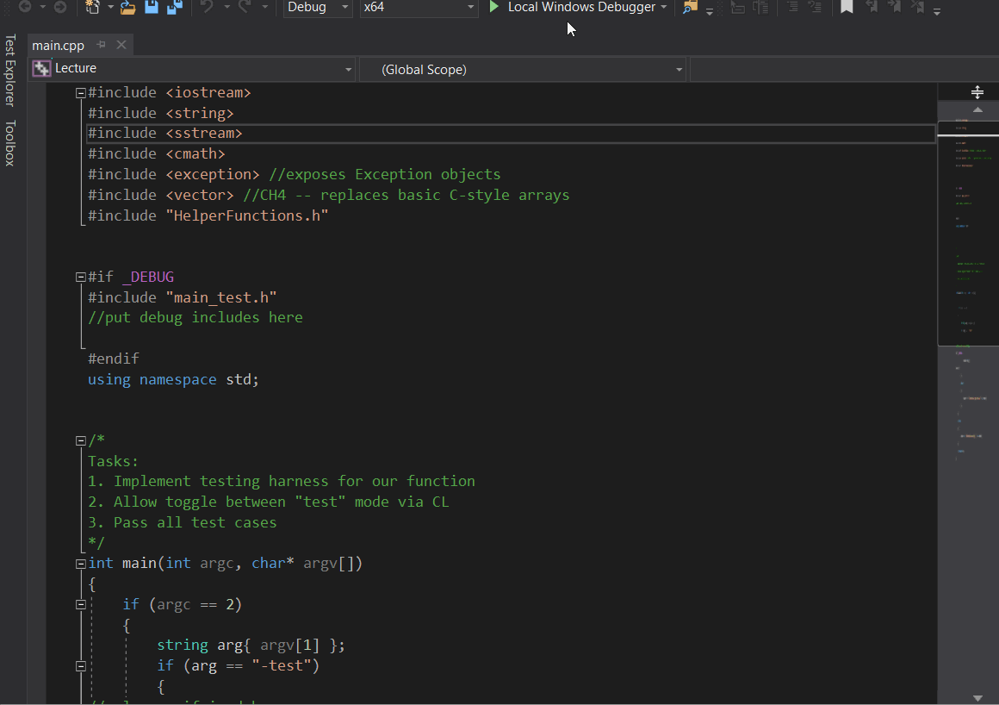

# CS 112 PA #3
This assignment continues our multi-week assignment related to image processing.  We will begin very simply but will end up with a complete program capable of applying several effects to multiple image types.  

For this assignment, you will be manipulating the "data" identified in your PA #2 assignment.  Your task is to turn every 3rd number (starting with element 0) in the data component to a zero.  Second, you program must now prompt the user for the file to manipulate instead of hard-coding "tinypix.ppm".  Lastly, your program should write this modified file to a user-specifid location.  Below, I provide an example run of the program: 

## Example program run
```
Enter source file: tinypix.ppm
Enter destination file: output.ppm
Program complete.
```

## Tinypix.ppm
Below is the source of tinypix.ppm
```
P3
4 4
255
0  0  0   100 0  0       0  0  0    255   0 255
0  0  0    0 255 175     0  0  0     0    0  0
0  0  0    0  0  0       0 15 175    0    0  0
255 0 255  0  0  0       0  0  0    255  255 255
```

## Output.ppm
Below is the source of output.ppm.  **NOTE** The formatting (exact place of numbers in file) **does not** have to match what I have.  As long as every 3rd number is set to 0 (starting with element 0), you're **good to go!**
```
P3
4 4
255
0  0  0    0 0  0        0  0  0     0   0 255
0  0  0    0 255 175     0  0  0     0    0  0
0  0  0    0  0  0       0 15 175    0    0  0
0 0 255    0  0  0       0  0  0     0  255 255
```

## Due date
This assignment is due Friday, September 27, 2019.  

## Submission
To submit your assignment, check your PA #3 code into *the same folder as this readme.*  Next, create an GIF walkthrough of your program using [LICEcap](https://forum.lumberhacks.org/viewtopic.php?f=10&t=9).  Upload this image to your repository and put a link to the image in your reflection. *Be sure to place your reflection in this folder!* Lastly, create a [PA #3 release on github](https://help.github.com/en/articles/creating-releases).  

## Example Walkthrough Image
Here is an image that I made running some lecture code.  Yours should look pretty similar but with PA #2.
  

## Grading
This assignment is worth 50 points:
* 45 points for completing the task (demonstrate good progress, regular github checkins, good github comments, maintaining your project board)
* 5 points for your reflection.  For inspiration, see [my prompts](../../docs/sample_reflection.md) 
